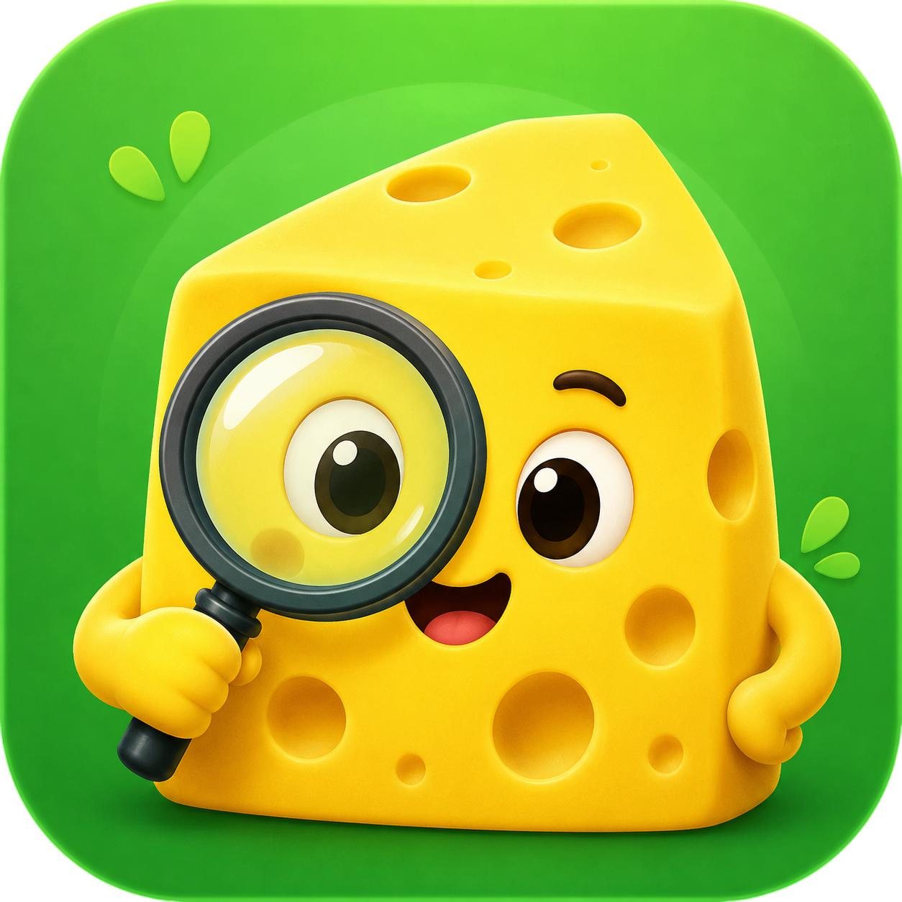

# 치즈 서치 - Chzzk Search

<div align="center">
  
</div>

치지직 채널의 다시보기와 클립을 검색하기 쉽게 만들어 주는 브라우저 확장 프로그램입니다. 채널의 `동영상` 탭과 `클립` 탭에 검색 도구를 추가하고, 별도 팝업 창에서는 스트리머 닉네임으로 다른 채널의 콘텐츠도 검색할 수 있습니다.

---

## 주요 기능

### 다시보기 검색

- 제목, 태그, 카테고리 검색을 지원합니다.
- 시작일/종료일과 빠른 기간 선택을 제공합니다.
- 달력에서 `2023년`부터 현재 년도까지 년/월을 빠르게 선택할 수 있습니다.
- 길이 필터, `다시보기`, `업로드`, `시청 중`, `시청안함` 유형 필터를 제공합니다.
- 최신순, 오래된순, 인기순, 라이브 시청순 정렬을 지원합니다.
- 시청 중인 영상은 카드 하단 진행 바로 시청 위치를 표시합니다.
- 검색 결과를 표시할 때 기존 치지직 페이지네이션은 숨기고, 초기화하면 원래대로 복구합니다.

### 클립 검색

- 클립 제목과 카테고리 검색을 지원합니다.
- 치지직의 `전체`, `24시간`, `7일`, `30일`, `최신순`, `인기순` 조건을 따라 수집합니다.
- 치지직 클립 카드와 유사한 세로형 카드 UI로 결과를 표시합니다.
- 썸네일 비율에 따라 세로형/가로형 blur 배경 표현을 구분합니다.
- 재생 수, 등록일, 재생 시간, 카테고리 pill을 함께 보여줍니다.
- 19세 연령 제한 클립은 치지직 원본 카드와 유사한 제한 표시를 적용합니다.
- 클립 수집 중에는 기존 결과를 점진적으로 표시하고, 진행 문구와 애니메이션으로 상태를 안내합니다.
- 카테고리 pill을 클릭하면 해당 카테고리만 필터링하고, `Ctrl + 클릭`하면 치지직 카테고리 페이지를 엽니다.

### 팝업 검색

- 채널 페이지의 `팝업` 버튼으로 넓은 별도 창에서 검색할 수 있습니다.
- 스트리머 닉네임으로 다른 채널의 다시보기와 클립을 검색할 수 있습니다.
- 검색 후보가 여러 명이면 사용자가 직접 채널을 선택할 수 있습니다.
- 후보 목록에는 채널 이미지, 채널명, 채널 ID, 공식 인증 마크가 표시됩니다.
- 공식 인증 마크 이미지를 불러오지 못하면 텍스트 배지로 대체합니다.
- 클립 팝업의 초기 준비 상태와 검색 중 상태에는 스켈레톤 UI와 animated SVG를 표시합니다.
- 라이트 모드와 다크 모드를 지원합니다.

### 안정성과 캐시

- API 요청과 전체 수집은 background service worker에서 처리합니다.
- 다시보기와 클립은 페이지당 최대 `50개`씩 요청합니다.
- 다시보기는 나머지 페이지를 최대 `3개`까지 병렬 요청합니다.
- 클립은 커서 기반 페이지네이션이므로 순차적으로 수집합니다.
- 서로 다른 전체 수집 작업은 최대 `2개`까지만 동시에 실행하고 나머지는 대기합니다.
- 동일한 목록을 여러 화면에서 동시에 요청하면 진행 중인 수집 작업을 공유합니다.
- 검색 중에는 content의 `검색` 버튼과 팝업 새로고침 버튼이 `검색 중지` 동작으로 바뀝니다.
- 수집 결과는 메모리와 `chrome.storage.local`에 캐시하며, 기본 TTL은 `1시간`입니다.
- 큰 클립 목록은 chunk 단위로 저장하고, content와 팝업 모두 chunk 캐시를 복원할 수 있습니다.
- 클립이 중간에 삭제될 수 있으므로 누락 항목은 한 번 더 확인한 뒤 삭제된 항목으로 처리합니다.
- 확장 프로그램 업데이트 시 열려 있는 치지직 탭에 새로고침 안내 배너를 표시합니다.

---

## 설치

### Chrome / Chromium

1. `chrome://extensions/`를 엽니다.
2. 우측 상단의 `개발자 모드`를 켭니다.
3. `압축해제된 확장 프로그램을 로드`를 누릅니다.
4. 이 프로젝트 폴더를 선택합니다.

---

## 사용 방법

### 채널 페이지에서 검색

1. `https://chzzk.naver.com/{channelId}/videos` 또는 `https://chzzk.naver.com/{channelId}/clips`로 이동합니다.
2. 페이지에 추가된 치즈 서치 검색 도구에서 검색어와 필터를 설정합니다.
3. `검색` 버튼을 눌러 목록을 불러옵니다.
4. 목록을 가져온 뒤에는 검색어, 기간, 유형, 정렬 조건을 바꿔 즉시 다시 필터링할 수 있습니다.

### 팝업에서 다른 채널 검색

1. 채널 페이지의 치즈 서치 검색 도구에서 `팝업` 버튼을 누릅니다.
2. 팝업 상단의 스트리머 입력란에 닉네임을 입력합니다.
3. 검색 결과가 여러 명이면 후보 목록에서 원하는 채널을 선택합니다.
4. 해당 채널의 다시보기 또는 클립 목록을 검색합니다.

---

## 검색 문법

검색어는 일반 단어뿐 아니라 `OR`, `AND`, 제외 조건, 괄호를 조합할 수 있습니다.

| 기능              | 예시                                                          | 설명                                        |
| ----------------- | ------------------------------------------------------------- | ------------------------------------------- |
| 일반 검색         | `대회 결승`                                                   | 두 단어를 모두 포함한 결과를 찾습니다.      |
| OR 검색           | `대회 \| 결승`, `대회 OR 결승`                                | 하나 이상의 단어를 포함한 결과를 찾습니다.  |
| AND 검색          | `대회 AND 결승`                                               | 모든 단어를 포함한 결과를 찾습니다.         |
| 제외 검색         | `대회 -예선`                                                  | 특정 단어를 포함한 결과를 제외합니다.       |
| 괄호 조합         | `(대회 \| 이벤트) 결승`                                       | 여러 조건을 묶어서 검색합니다.              |
| 태그 검색         | `#게임`                                                       | 다시보기 태그에서 검색합니다.               |
| 카테고리 검색     | `@메이플`, `category:메이플`, `cat:메이플`, `카테고리:메이플` | 카테고리에서만 검색합니다.                  |
| 띄어쓰기 카테고리 | `category:"메이플스토리 월드"`, `@"메이플스토리 월드"`        | 빈칸이 포함된 카테고리를 정확히 검색합니다. |

다시보기는 제목, 태그, 카테고리를 대상으로 검색합니다. 클립은 제목과 카테고리를 대상으로 검색합니다.

---

## 패키징

Chrome용 `.zip`은 다음 명령으로 생성합니다.

```bash
./scripts/build-chrome-package.sh
```

Chrome 패키징 스크립트는 다음 작업을 수행합니다.

- Chrome용 `manifest.json`을 그대로 패키지에 포함합니다.
- `src`, `icons`, `popup.html`, SVG 애셋, README를 임시 빌드 디렉터리에 복사합니다.
- `dist/chzzk-search-chrome-v{version}.zip`을 생성합니다.

---

## 참고 사항

- 치지직의 페이지 구조나 API가 변경되면 일부 기능이 동작하지 않을 수 있습니다.
- 전체 목록을 처음 불러오는 시간은 채널의 다시보기 또는 클립 개수와 네트워크 상태에 따라 달라집니다.
- 클립 목록은 커서 기반으로 수집하므로 다시보기보다 최초 로딩 시간이 길 수 있습니다.
- 본 확장 프로그램은 치지직과 관련이 없으며, 네이버, 치지직, CHZZK은 NAVER의 등록상표입니다.

---

## 업데이트 내역

### 1.0.0

- 다시보기와 클립 검색 기능을 추가했습니다.
- 콘텐츠 페이지와 팝업 검색 UI를 추가했습니다.
- 기간, 길이, 유형, 정렬 필터와 고급 검색 문법을 지원합니다.
- 카테고리 필터 chip, 카테고리 pill 클릭 필터링, `Ctrl + 클릭` 카테고리 페이지 열기를 추가했습니다.
- 임시 캐시 공유, chunk 캐시 복원, 클립 수집 재연결, 삭제 클립 확인 로직을 추가했습니다.
- 전체 수집 작업의 전역 동시 실행 제한과 검색 중지 기능을 추가했습니다.
- 팝업 스트리머 검색 후보 선택과 인증 마크 표시를 추가했습니다.
- 클립 카드 skeleton, empty/searching/loading animated SVG UI를 추가했습니다.
- Chrome 패키징 구성을 추가했습니다.
